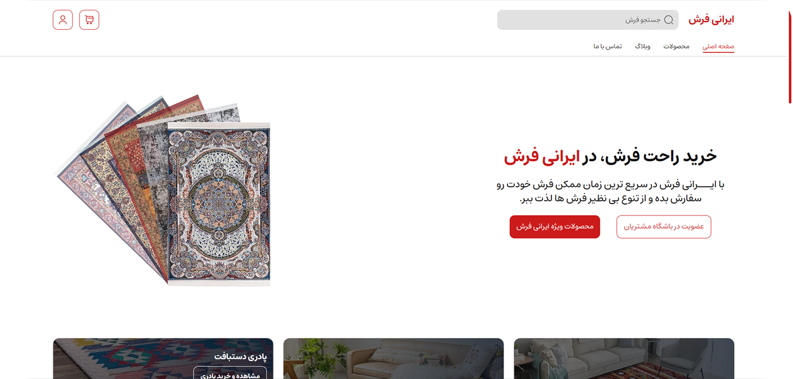

  

<h3 align="center">IraniFarsh</h3>

  <a href="https://m7a1s.github.io/IraniFarsh/" style="margin: 0 10px;">View Demo</a>

## 📸 Preview

## 🚀 Features

- Advanced admin panel
- High performance optimization and high loading speed
- Advanced search capabilities with multiple filters
- Developed using the latest and most advanced libraries

## 🛠️ Tech Stack

<table align="left">
  <thead>
    <tr>
      <th style="text-align: left;">Tech</th>
      <th style="text-align: left;">Description</th>
    </tr>

  </thead>
  <tbody>
    <tr>
      <td style="text-align: left;">React</td>
      <td style="text-align: left;">Frontend library</td>
    </tr>
    <tr>
      <td style="text-align: left;">React Router</td>
      <td style="text-align: left;">Routing library for React</td>
    </tr>
      <tr>
      <td style="text-align: left;">TypeScript</td>
      <td style="text-align: left;">Programming language</td>
    </tr>
    <tr>
      <td style="text-align: left;">Tailwind CSS</td>
      <td style="text-align: left;">Utility-first CSS framework</td>
    </tr>
    <tr>
      <td style="text-align: left;">Material UI</td>
      <td style="text-align: left;">UI component library</td>
    </tr>
    <tr>
      <td style="text-align: left;">Swiper</td>
      <td style="text-align: left;">JavaScript library for sliders</td>
    </tr>
    <tr>
      <td style="text-align: left;">Leaflet</td>
      <td style="text-align: left;">Interactive maps library</td>
    </tr>
    <tr>
      <td style="text-align: left;">Iconsax</td>
      <td style="text-align: left;">Icon font scripts</td>
    </tr>
  </tbody>
</table>
